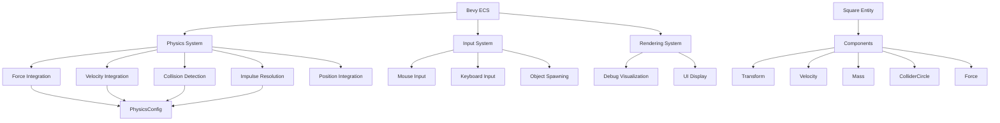

# Phys Engine

A 2D physics simulation engine built with Rust and the Bevy game engine. This project implements fundamental physics concepts including rigid body dynamics, collision detection, and impulse resolution.

## 🎯 Overview

This physics engine was developed as a class project in early 2026, demonstrating practical implementation of Newtonian physics principles. The engine features real-time 2D physics simulation with interactive controls, visual debugging tools, and conservation of momentum verification.

## ✨ Features

- **Rigid Body Dynamics**: Mass-based physics with velocity and force integration
- **Collision Detection**: Circle-based collision detection with multi-directional normals
- **Impulse Resolution**: Realistic collision response with configurable restitution
- **Interactive Controls**: Mouse-based object manipulation and spawning
- **Visual Debugging**: Velocity vectors and momentum/energy display
- **Configurable Physics**: Adjustable friction, restitution, and damping
- **Conservation Laws**: Real-time momentum and kinetic energy tracking

## 🏗️ Architecture

### High-Level Diagram



### Core Components

- **PhysicsConfig**: Global physics parameters (gravity, friction, restitution)
- **Square Entity**: Physical objects with mass, velocity, and collision geometry
- **Contact System**: Message-based collision detection and resolution
- **Integration Pipeline**: Fixed timestep physics updates

## 📁 Project Structure

```
phys_engine/
├── src/
│   └── main.rs          # Main application and physics implementation
├── Cargo.toml           # Project dependencies and configuration
├── Cargo.lock           # Dependency lock file
├── README.md           # This file
└── LICENSE             # MIT License
```

### Key Files

- `src/main.rs` (486 lines): Complete physics engine implementation including:
  - ECS component definitions
  - Physics integration systems
  - Collision detection and resolution
  - Input handling and UI
  - Debug visualization

## 🚀 Getting Started

### Prerequisites

- **Rust**: Install from [rustup.rs](https://rustup.rs/)
- **Cargo**: Included with Rust installation

### Installation & Running

1. **Clone or download** the project
2. **Navigate** to the project directory:
   ```bash
   cd physics-engine
   ```
3. **Run** the application:
   ```bash
   cargo run --release
   ```

### Controls

| Action | Control |
|--------|---------|
| **Spawn Square** | `SPACE` |
| **Remove Square** | `R` (hover over square) |
| **Drag/Throw** | Left mouse button (hold and drag) |
| **Toggle Friction** | `F` |
| **Adjust Restitution** | `↑/↓` arrow keys |
| **Exit** | Close window |

### Physics Parameters

- **Friction**: Toggle on/off with `F` key
- **Restitution**: Adjust with arrow keys (0.0 = inelastic, 1.0 = elastic)
- **Linear Damping**: Configurable velocity decay when friction enabled
- **Gravity**: Currently disabled (set to Vec2::ZERO)

## 🔬 Technical Implementation

### Physics Pipeline

The engine uses a fixed timestep update loop with the following stages:

1. **Force Integration**: Apply external forces (gravity, user input)
2. **Velocity Integration**: Update velocities based on forces and mass
3. **Collision Detection**: Find overlapping circle colliders
4. **Impulse Resolution**: Apply collision impulses and positional correction
5. **Position Integration**: Move objects based on current velocity

### Collision System

- **Circle Colliders**: Simple radius-based collision detection
- **Multi-directional Normals**: Collision response in any direction
- **Impulse-based Resolution**: Conservation of momentum and energy
- **Positional Correction**: Prevents object interpenetration

### Performance Optimizations

- **Fixed Timestep**: Consistent physics updates regardless of frame rate
- **Message-based Communication**: Efficient collision event handling
- **Component-based Architecture**: Cache-friendly ECS design
- **Release Build Optimization**: Size and performance optimized

## 📊 Physics Verification

The engine includes real-time verification of physical laws:

- **Momentum Conservation**: Total linear momentum displayed in UI
- **Energy Tracking**: Kinetic energy calculation and display
- **Collision Types**: Visual indication of elastic/inelastic collisions

## 🛠️ Dependencies

- **Bevy 0.17.3**: Game engine providing ECS, rendering, and input systems

## 📈 Future Enhancements

Potential improvements for the physics engine:

- Multiple collider shapes (rectangles, polygons)
- Rotational physics and torque
- Joint constraints and soft bodies
- Performance optimizations for large numbers of objects
- 3D physics extension

## 🎓 Academic Context

This project was developed for a physics class assignment, successfully demonstrating practical implementation of:
- Newton's laws of motion
- Conservation of momentum
- Elastic and inelastic collisions
- Numerical integration methods
- Real-time simulation techniques
